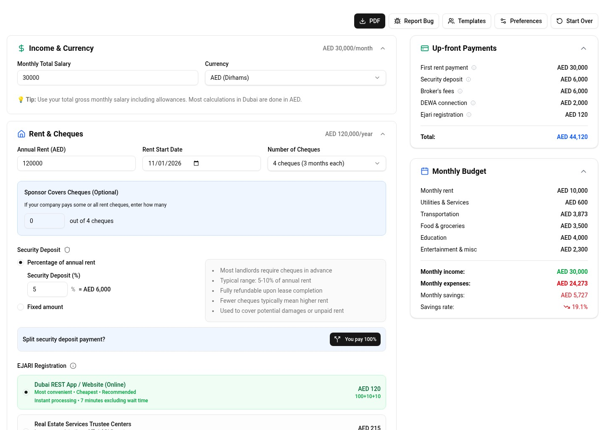
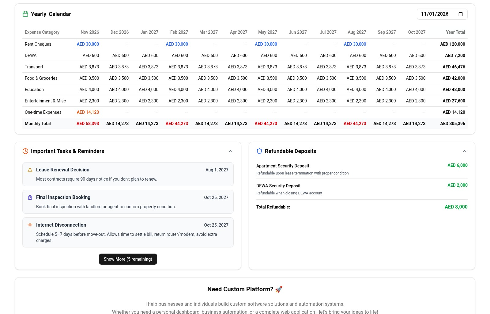
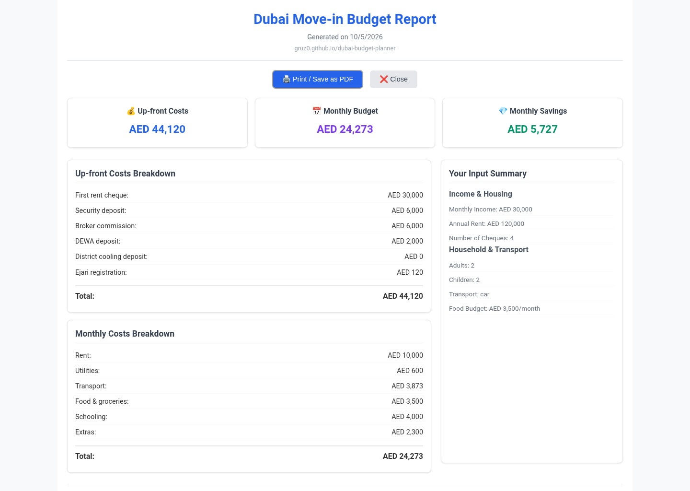

# Dubai Budget Planner

A free, browser-only calculator for the up-front and monthly costs of moving to Dubai.

[Open the planner](https://gruz0.github.io/dubai-budget-planner/) · [Connect with Alexander Kadyrov](https://www.linkedin.com/in/alexanderkadyrov/) · [View the source](https://github.com/gruz0/dubai-budget-planner)



The screenshots in this README use the built-in “Family of 4” starting point. No real household data is shown.

## Why it exists

The annual rent on a Dubai tenancy contract is only where the accounting starts. Rent is paid with post-dated cheques, so the first payment can be a quarter of the year or all of it. On the same day you also owe a security deposit, broker commission, the DEWA deposit and Ejari registration, and possibly district cooling and gas deposits and a kitchen's worth of appliances.

None of these fees is a secret. The problem is that nobody presents them as one number. I built this planner after three apartment moves in Dubai where the total cash needed in the first month was still higher than we had planned.

It answers two questions:

- How much cash do I need before I get the keys?
- What will a normal month cost afterwards, and what is left of my salary?

## What it supports

- Up-front costs: first rent cheque by cheque count, security deposit, broker commission, Ejari registration, DEWA, district cooling and gas deposits, appliances, moving and relocation services
- Monthly budget: rent, utilities, home internet, transport (car rental with fuel and Salik, or public transport), schooling, food, mobile, gym and custom recurring expenses
- Savings amount and savings rate against a salary entered in AED or USD
- Employer sponsorship: split rent cheques, broker fee, deposits and relocation costs between you and a sponsor
- Yearly calendar that places every rent cheque and one-time cost in the month it falls due
- Refundable deposits summary and move-out reminders dated from the lease start
- Four starting points (solo professional, couple, family of four, young family) that can be linked directly with `?template=<id>`
- Printable report that saves as a PDF from the browser's print dialog
- Your budget is kept in the browser between visits, with **Start Over** to clear it
- AED or USD display, a light, dark or system theme, and a mobile layout

### When does the money actually leave the account?



### Can I keep a copy?



## Data and privacy

Everything is calculated in the browser. The planner has no backend, no account and no database, and the figures you enter are never sent anywhere. The PDF report is generated locally too.

So that a reload does not wipe your work, the budget is saved in your browser's local storage on your own device. **Start Over** deletes it.

The app uses cookie-free Umami analytics on its production host for page visits and two fixed actions. These events carry no budget figures.

## Assumptions

Default fees and price ranges follow published 2026 Dubai rates and are listed in the planner under **Key Assumptions & Sources**. Every default can be overridden. Prices and fees change, and they vary by area and building, so verify the numbers that matter with the provider before you sign.

These are estimates, not financial advice. The project is independent and is not affiliated with any UAE government entity, DEWA, or the Dubai Land Department.

## Run locally

```bash
bun install
bun run dev
```

Open the local address printed by Vite and pick a starting point.

## Contributing

See [CONTRIBUTING.md](CONTRIBUTING.md) for prerequisites, project scripts, testing, showcase-image generation, and deployment notes.

## About the author

I'm [Alexander Kadyrov](https://www.linkedin.com/in/alexanderkadyrov/), a software engineer based in Dubai. I build AI solutions and MVPs, and work with founders as a fractional CTO. This planner is an example of the kind of focused tool I like to ship: one job, real numbers, no sign-up.

If you need something similar for your business, [book a call](https://cal.com/alexkadyrov/startups) or message me on LinkedIn.
